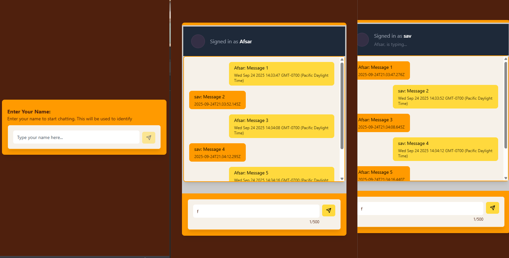

# ConvoMSG -  implmentation of socket.io 

Developed a real-time chat application utilizing WebSocket technology and event listeners.  
- Backend: Implemented using Node.js, Express (as a lightweight HTTP server), and Socket.IO.  
- Frontend: Delivered three distinct implementations with React, Angular, and Vue.js frameworks.  

## Authors

- [@afsarzan](https://www.github.com/afsarzan)

## 🚀 About Me
I'm a full stack developer...

## 🔗 Links

## Screenshots

